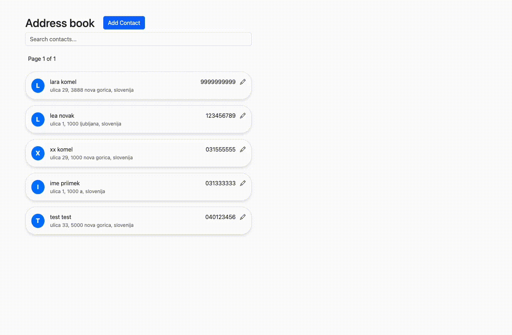

api runs on http://localhost:8000/
frontend on http://localhost:4200/.

set the database name, username and password in Address_Book/appsettings.json: 
"DefaultConnection": "Server=localhost;Database=AddressBook;User Id=your_username;Password=your_password;TrustServerCertificate=True;"

run migrations: 
cd Address_Book
dotnet restore
dotnet ef migrations add InitialCreate
dotnet ef database update
dotnet run

frontend: 
npm install
ng serve

demo:

